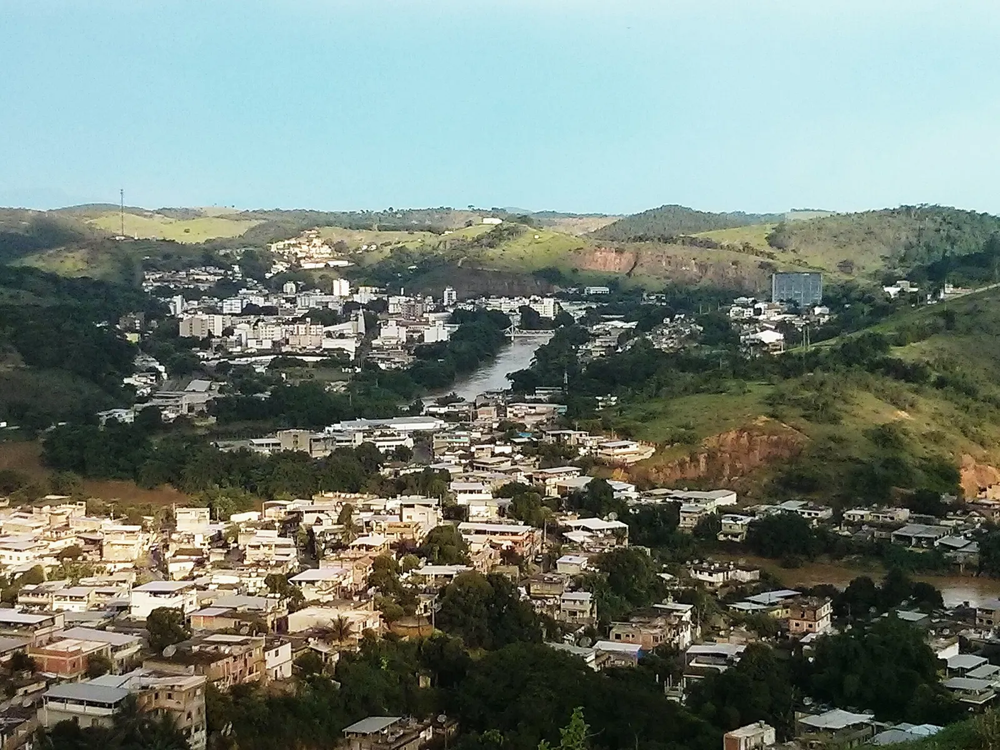

# Cataguases: luz, modernismo e patrimônio



Uma experiência digital interativa sobre a eletrificação, a indústria, a cultura
modernista e o patrimônio de Cataguases, na Zona da Mata de Minas Gerais.

![Website estático][badge-static]
![Acessibilidade Lighthouse 100][badge-accessibility]
![HTML, CSS e JavaScript][badge-stack]

## Sobre o projeto

Este website transforma a pesquisa **Cataguases entre luz, modernismo e
patrimônio** em uma narrativa visual dividida em cinco capítulos:

1. **Eletrificação:** a criação da Companhia Força e Luz
   Cataguazes-Leopoldina e o pioneirismo intermunicipal da Usina Maurício.
2. **Indústria:** a transição da economia cafeeira para uma base industrial e
   as transformações sociais do trabalho.
3. **Cultura:** a Revista Verde, o cinema de Humberto Mauro e a continuidade
   do movimento modernista.
4. **Patrimônio:** arquitetura, paisagismo, murais, mobiliário e escultura como
   uma linguagem integrada de cidade.
5. **Presente:** turismo cultural, preservação, acessibilidade e os desafios de
   manter o patrimônio vivo.

O conteúdo evita a afirmação imprecisa de que Cataguases foi a primeira cidade
eletrificada do Brasil. Seu pioneirismo está principalmente no modelo regional
e duradouro de fornecimento de energia para mais de um município.

## Experiência

- Linha do tempo histórica navegável por mouse, toque e teclado.
- Cena interativa sobre a chegada da eletricidade em 1908.
- Visualização da expansão regional da rede elétrica.
- Abas sobre literatura, cinema e arquitetura.
- Galeria de marcos arquitetônicos com detalhes em modais.
- Indicadores sobre turismo e alcance cultural.
- Temas claro e escuro com preferência persistida no navegador.
- Layout responsivo para desktop, tablet e celular.
- Respeito à preferência de movimento reduzido do sistema.

## Executar localmente

O projeto não exige instalação de dependências nem etapa de compilação. Sirva
a pasta por HTTP para garantir o comportamento consistente dos recursos.

Com Python:

```bash
python -m http.server 8000
```

Depois, acesse [http://localhost:8000](http://localhost:8000).

Também é possível abrir `index.html` diretamente no navegador, embora um
servidor local seja recomendado.

## Estrutura

```text
.
├── assets/                                      # Fotografias otimizadas em WebP
├── Cataguases entre luz, modernismo e patrimônio.pdf
├── dep-historia-cataguases.md                   # Pesquisa histórica e referências
├── index.html                                   # Conteúdo e estrutura semântica
├── script.js                                    # Interações e dados da experiência
└── styles.css                                   # Design system e responsividade
```

## Design e acessibilidade

A direção visual combina linguagem editorial e referências geométricas do
modernismo brasileiro. O sistema utiliza tokens para cores, tipografia,
espaçamento, bordas e movimento, com foco em consistência e leitura.

Recursos de acessibilidade:

- Estrutura semântica e hierarquia de títulos.
- Link para pular diretamente ao conteúdo.
- Navegação completa por teclado.
- Estados de foco visíveis.
- Rótulos e mensagens para tecnologias assistivas.
- Contraste compatível com WCAG.
- Alternativa para usuários que preferem movimento reduzido.
- Textos alternativos nas imagens de conteúdo.

## Validação

O projeto foi verificado com:

- `html-validate` para semântica e validade do HTML.
- `node --check` para sintaxe do JavaScript.
- Chromium automatizado nos viewports `1440x900` e `390x844`.
- Verificação de imagens quebradas, erros de console e overflow horizontal.
- Lighthouse: acessibilidade `100`, boas práticas `100` e performance `77` em
  servidor local sem cache ou compressão configurados.

## Fontes históricas

O documento-base cruza fontes públicas, acadêmicas, empresariais e locais.
Entre as referências centrais estão:

- [Memória da Eletricidade][source-electricity]
- [IPHAN: Conselho Consultivo do Patrimônio Cultural][source-iphan]
- [Vitruvius: Patrimônio modernista em Cataguases][source-vitruvius]
- [Biblioteca Brasiliana Guita e José Mindlin: Revista Verde][source-verde]

## Imagens

As fotografias foram obtidas no Wikimedia Commons e mantêm suas respectivas
licenças Creative Commons. Os créditos e o contexto de uso estão disponíveis
na seção de fontes do website.

## Tecnologias

- HTML5
- CSS3
- JavaScript sem frameworks
- Fontes DM Sans e Newsreader
- Imagens WebP

## Estado

O website está funcional e pronto para hospedagem estática em serviços como
GitHub Pages, Cloudflare Pages, Netlify ou Vercel.

[badge-static]: https://img.shields.io/badge/website-estático-173f58
[badge-accessibility]: https://img.shields.io/badge/acessibilidade-100%2F100-214c3d
[badge-stack]: https://img.shields.io/badge/HTML%20%7C%20CSS%20%7C%20JavaScript-vanilla-e3432f
[source-electricity]: https://memoriadaeletricidade.com.br/acervo/1375/energisa-minas-gerais
[source-iphan]: https://www.gov.br/iphan/pt-br/acesso-a-informacao/participacao-social/conselhos-e-orgaos-colegiados/atas-do-conselho-consultivo-do-patrimonio-cultural/de-1991-ate-2000/7a-reuniao-ordinaria-do-conselho-consultivo-07-12-1994/%40%40display-file/file
[source-vitruvius]: https://vitruvius.com.br/revistas/read/arquitextos/05.054/527
[source-verde]: https://blog.bbm.usp.br/2018/verde-a-revista-modernista-do-interior-mineiro/
