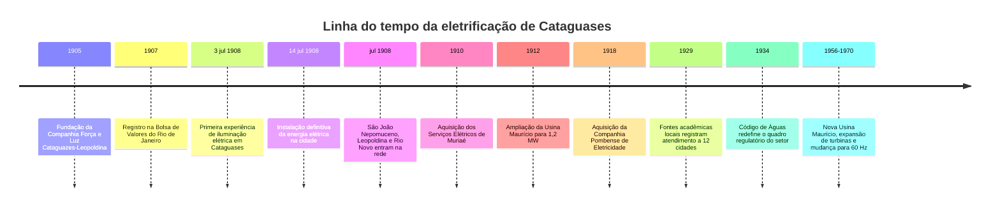

# Cataguases entre luz, modernismo e patrimônio

## Sumário executivo

Cataguases é considerada pioneira na eletricidade não porque tenha sido a **primeira** cidade brasileira a receber iluminação elétrica, mas porque reuniu, muito cedo, quatro características raras no país: uma concessionária criada no interior em 1905, a entrada em operação da **Usina Maurício** em 1908, o uso combinado de **hidreletricidade e iluminação pública/particular** e, sobretudo, a condição de a usina ser apontada pela **Memória da Eletricidade** como a **primeira do Brasil a fornecer energia para mais de uma cidade**, atendendo inicialmente Cataguases e Leopoldina e irradiando-se, ainda em julho de 1908, para São João Nepomuceno e Rio Novo. Em outras palavras, o pioneirismo cataguasense é menos o da “primeira lâmpada do Brasil” e mais o de uma **eletrificação regional, empresarial e duradoura** a partir de um município médio da Zona da Mata. citeturn7view3turn7view1turn40search2turn40search3

A eletrificação precoce teve efeitos econômicos e urbanos significativos. Ela se associou à transição de Cataguases de uma economia fortemente vinculada ao café para uma base industrial, especialmente têxtil, favorecendo a integração regional, a expansão de serviços urbanos e a reorganização do cotidiano de ruas, casas, fábricas e comércio. Fontes acadêmicas e locais ligam esse processo à industrialização, ao êxodo rural, à formação de vilas operárias e à intensificação da circulação de pessoas, capitais e ideias na cidade e na região. citeturn35search4turn42search7turn34search1turn42search4

A importância de Cataguases em cultura, turismo e arquitetura decorre de uma combinação rara: base econômica industrial, elites locais com forte mecenato, presença precoce de eletricidade, vida intelectual modernista e produção artística de alta qualidade. O parecer do Conselho Consultivo do IPHAN de 1994 qualificou Cataguases como um “lugar da modernidade” singular no Brasil, por articular poesia, edição gráfica, cinema, arquitetura, jardins, murais, mobiliário e escultura em densidade excepcional para uma cidade do interior. O acervo modernista local inclui obras de **Oscar Niemeyer, Roberto Burle Marx, Cândido Portinari, Paulo Werneck, Djanira, Jan Zach, Anísio Medeiros, Emeric Marcier** e outros. citeturn32view2turn17view0

No turismo cultural, Cataguases vem convertendo esse capital histórico em roteiros e equipamentos: a prefeitura estruturou em 2026 a rota **“Cataguases – Moderna e Eterna”**, enquanto a Fundação Ormeo Junqueira Botelho mantém equipamentos como o **Museu Energisa**, o **Centro Cultural Humberto Mauro**, o **Memorial Humberto Mauro** e o **Anfiteatro Ivan Müller Botelho**. Há público mensurável em alguns equipamentos e eventos, mas os dados oficiais são fragmentados e pouco padronizados ao longo do tempo. Em preservação, o município combina tutela federal do IPHAN, ação municipal via **DEMPHAC**, incentivos do **ICMS Patrimônio Cultural** e projetos recentes de restauro, como o do **Colégio Cataguases** no PAC e a consulta pública para restauração do **Cine Edgard**. Os principais desafios atuais são financiamento contínuo, burocracia de gestão do tombamento, acesso e interpretação pública do patrimônio, e a necessidade de incorporar mais explicitamente a memória operária e popular ao discurso patrimonial dominante. citeturn24view0turn19search8turn39search3turn39search18turn28search1turn37search0turn37search11turn37search6

## Eletrificação e pioneirismo regional

A cronologia básica da eletrificação cataguasense é relativamente sólida nas fontes oficiais e de memória empresarial. A **Companhia Força e Luz Cataguazes-Leopoldina** foi constituída em **26 de fevereiro de 1905**, em Cataguases, por **José Monteiro Ribeiro Junqueira, João Duarte Ferreira e Norberto Custódio Ferreira**. Em **maio de 1907**, a companhia abriu capital e tornou-se a **terceira sociedade anônima** registrada na Bolsa de Valores do Rio de Janeiro. Em **julho de 1908**, inaugurou a **Usina Maurício**, no rio Novo, com **800 kW**, iniciando o atendimento de Cataguases e Leopoldina; em **1912**, a usina foi ampliada para **1,2 MW**. A partir daí, a empresa expandiu sua atuação: Muriaé em 1910, Rio Pomba em 1918, além de outras aquisições posteriores na Zona da Mata. citeturn7view3turn7view0

O episódio inaugural da iluminação em Cataguases também está bem documentado. Segundo a reconstrução histórica divulgada pela própria Energisa com base em documentação e imprensa local, em **3 de julho de 1908, às 20 horas**, a cidade viveu a primeira experiência de iluminação elétrica com **160 lâmpadas incandescentes de 32 velas** e **quatro lâmpadas de arco voltaico de 600 velas**; a **instalação definitiva** ocorreu em **14 de julho de 1908**. Ainda naquele mês, a mesma rede alcançou **São João Nepomuceno (7/7), Leopoldina (16/7) e Rio Novo (23/7)**. citeturn7view1

O ponto historicamente mais forte para sustentar o “pioneirismo” de Cataguases está no verbete da **Memória da Eletricidade**, instituição reconhecida no setor e cadastrada no CONARQ como entidade custodiante de acervos arquivísticos. Esse verbete afirma que a **Usina Maurício** foi a **sexta hidrelétrica construída no país para iluminação pública** e a **primeira a fornecer energia elétrica para mais de uma cidade**. Essa formulação é crucial: Cataguases não lidera a cronologia brasileira absoluta, mas ocupa posição pioneira na **eletrificação intermunicipal** e na formação de um modelo regional de distribuição. citeturn7view3turn40search18

Do ponto de vista jurídico, as fontes acessíveis indicam três camadas normativas. A primeira é a das **concessões e privilégios municipais** da Primeira República: uma fonte acadêmica baseada em documentação local registra a fórmula “**Fica concedido à Companhia Força e Luz Cataguases-Leopoldina privilégio por 25 anos** para exploração, uso e gozo da eletricidade…”, o que revela o padrão jurídico típico da época, em que câmaras e prefeituras contratavam diretamente serviços de eletricidade. A segunda camada é estadual/municipal ainda visível em decretos mineiros de **1934** e **1935**, que fazem referência a contratos da companhia com câmaras municipais como São João Nepomuceno e Rio Branco, mostrando a persistência do modelo contratual local. A terceira é nacional: o **Código de Águas de 1934** reorganizou o setor e reforçou o papel da União nas concessões hidrelétricas, alterando o ambiente institucional em que empresas como a Cataguases-Leopoldina operavam. citeturn43search0turn8search1turn8search4turn9search0turn9search9



A linha do tempo acima sintetiza informações de memória empresarial, memória setorial e pesquisa acadêmica; para 1929, a principal evidência acessível online é indireta, via citação acadêmica de jornal local, o que recomenda cautela interpretativa. citeturn7view0turn7view1turn7view3turn34search14

Em comparação com outros municípios brasileiros, Cataguases foi **posterior** a marcos nacionais decisivos: **Campos dos Goytacazes** teve o primeiro serviço público de iluminação elétrica do Brasil e da América do Sul em **1883**; **Diamantina** figura no mesmo ano entre as aplicações pioneiras e é tradicionalmente lembrada pela primeira hidrelétrica brasileira associada à mineração; **Porto Alegre** tornou-se a primeira capital brasileira com serviço público de iluminação elétrica em **1887**; **Juiz de Fora**, com **Marmelos** em **1889**, foi marco da geração hidrelétrica para serviço público; **Rio de Janeiro** e **São Paulo** eletrificaram-se em escala urbana antes ou em paralelo ao início da operação da CFLCL. Assim, a afirmativa correta é que Cataguases esteve **entre as cidades pioneiras** da eletrificação brasileira e foi **especialmente pioneira** no modelo regional e intermunicipal de suprimento. citeturn40search2turn40search3turn40search1

## Impactos econômicos, industriais e sociais

As fontes convergem em associar a eletrificação à virada econômica de Cataguases. Segundo estudo apresentado na ANPUH, a cidade iniciou seu processo de industrialização no começo do século XX, com destaque para a **Fábrica de Fiação e Tecelagem**, inaugurada em **1906**, inicialmente movida a vapor; pouco depois, a Companhia Força e Luz Cataguases-Leopoldina entrou em operação, fornecendo a infraestrutura energética que ajudou a consolidar a industrialização local. O próprio guia da arquitetura modernista de Cataguases, em sua versão divulgada em bases secundárias, interpreta a companhia elétrica como parte do conjunto de fatores que favoreceram a passagem da economia agrária para a industrial. citeturn35search4turn42search7

O impacto econômico não ficou restrito ao perímetro urbano de Cataguases. A **Memória da Eletricidade** afirma que a CFLCL passou a atender vários municípios da Zona da Mata, contribuindo “significativamente para o desenvolvimento manufatureiro e a eletrificação dos principais centros urbanos da região”. Uma tese recente sobre a formação socioespacial da cidade, em snippet indexado pelo buscador, registra que uma notícia do **jornal Cataguases**, de **14 de julho de 1929**, já falava em **12 cidades** atendidas pela Luz Cataguases-Leopoldina. A expansão da rede, portanto, transformou Cataguases em nó de uma economia regional eletrificada, e não apenas em beneficiária passiva de um serviço local. citeturn7view3turn34search14

O efeito social mais visível foi a transformação do cotidiano. Em julho de 1908, a eletricidade chegou não só às ruas, mas também a **casas, estabelecimentos comerciais e fábricas** das cidades atendidas pela companhia. O acesso à luz artificial alterou horários de funcionamento, sociabilidade noturna, visibilidade urbana e percepção de modernidade. Em Cataguases, a imprensa local celebrou a mudança em termos quase civilizatórios, o que mostra que a eletricidade foi percebida menos como um simples serviço utilitário e mais como um marcador simbólico de ingresso na modernidade. citeturn7view1

A industrialização associada à energia elétrica também teve efeitos urbanos e trabalhistas. O guia modernista de Cataguases registra que a industrialização favoreceu o **êxodo rural** e o surgimento de **vilas operárias**. Outro estudo sobre a liga operária local observa que o desenvolvimento industrial integrou Cataguases a centros urbanos maiores, ampliando a circulação de pessoas e informações. Isso ajuda a explicar por que, numa cidade do interior, floresceram movimentos culturais de vanguarda entre os anos 1920 e 1950: a energia elétrica criou condições materiais; a industrialização, condições sociais; e o mecenato industrial, condições institucionais. citeturn42search7turn34search1

É importante, no entanto, evitar uma narrativa excessivamente linear. A modernização urbana também veio acompanhada de políticas higienistas e de forte controle do espaço. Fontes acadêmicas sobre Cataguases nas décadas de 1930 e 1940 registram a demolição de “**cortiços infectos e insalubres**” e outras intervenções urbanas que buscavam redefinir a imagem da cidade. A eletrificação, assim, articulou-se a um projeto de modernização seletiva: ampliou conforto, produtividade e serviços, mas também participou de uma ordenação urbana que nem sempre incorporou de modo igualitário os grupos populares. citeturn35search1turn35search8

## Arquitetura, arte e cultura modernista

A excepcionalidade cultural de Cataguases não decorre apenas de possuir alguns edifícios notáveis; decorre de ter produzido um **ecossistema modernista** relativamente coerente. No parecer que embasou o tombamento federal de 1994, o conselheiro do IPHAN afirmou que Cataguases tinha um valor “**único**” para a história da arte moderna brasileira, pois reunia, no mesmo lugar, **poesia, prosa, edição gráfica, arquitetura, painéis, revestimentos, mobiliário, quadros, esculturas, jardins e cinema**. O texto também destaca a presença, na cidade, de Oscar Niemeyer, Francisco Bologna, Aldary Toledo, Roberto Burle Marx, Portinari, Paulo Werneck, Jan Zach, Anísio Medeiros e outros. citeturn32view2

Esse ambiente foi preparado por movimentos culturais anteriores ao ciclo arquitetônico dos anos 1940-1960. A **Revista Verde** foi criada em **setembro de 1927** em Cataguases e encerrou suas atividades em **maio de 1929**; a ALMG também reconhece o **Movimento Verde** como criação de um grupo de jovens da cidade em 1927-1929. Em paralelo, o **Ciclo de Cinema de Cataguases** projetou **Humberto Mauro** como pioneiro do cinema brasileiro, e o próprio Centro Cultural Humberto Mauro se apresenta hoje como guardião dessa memória. Essa sequência — literatura, cinema e depois arquitetura — explica por que o modernismo cataguasense não é um episódio isolado, mas uma continuidade. citeturn46search0turn46search19turn19search8

No campo arquitetônico, dois marcos sintetizam a virada. A **Residência Francisco Inácio Peixoto**, projeto de **Oscar Niemeyer** de **1941** segundo a literatura especializada, é descrita como uma residência moderna com traços da arquitetura tradicional brasileira, jardins de Burle Marx, esculturas e mobiliário de Tenreiro. Já o **Colégio Cataguases**, concebido entre **1945 e 1949**, articula arquitetura escolar moderna, paisagismo de Burle Marx, painel abstrato de Paulo Werneck, escultura “O Pensador” de Jan Zach e o célebre painel **“Tiradentes”** de Portinari, inaugurado em 1949. citeturn17view3turn32view1turn32view3turn18search2

A cidade também preserva uma camada pré-modernista importante. A **Chácara Dona Catarina**, erguida em **1888**, é identificada em pesquisa histórica local como exemplar dos **chalés românticos** associados ao ciclo do café. Sua permanência no centro ajuda a demonstrar que o valor patrimonial de Cataguases não está apenas no modernismo, mas no diálogo entre a cidade oitocentista, a industrialização e a vanguarda artística do século XX. O problema é que, como observam estudos críticos, o discurso patrimonial frequentemente privilegia o modernismo “nobre” e corre o risco de apagar a memória operária, as vilas e outras camadas sociais da cidade. citeturn45search0turn37search6turn37search15

### Marcos arquitetônicos selecionados

| Nome | Ano | Arquiteto | Estilo | Uso atual | Proteção |
|---|---:|---|---|---|---|
| Colégio Cataguases | 1945–1949 | Oscar Niemeyer; paisagismo de Roberto Burle Marx | Modernismo brasileiro | Escola Estadual Manoel Ignácio Peixoto | Tombamento federal individual no conjunto de 1994; restauro selecionado no PAC. citeturn32view1turn32view3turn28search1 |
| Residência Francisco Inácio Peixoto | 1941 | Oscar Niemeyer; jardins de Burle Marx | Modernismo com diálogo vernacular | Residência particular | Tombamento federal individual no conjunto de 1994. citeturn17view3turn32view0 |
| Cine-Teatro Edgard | projeto de 1946; inauguração em 1953 | Aldary Toledo e Carlos Leão | Modernismo | Bem em processo de requalificação cultural | Fontes acadêmicas o tratam como tombado pelo IPHAN em 1994; a prefeitura abriu consulta pública de restauração em 2026. citeturn18search4turn37search0turn37search1 |
| Santuário de Santa Rita de Cássia | pedra fundamental em 1944; obras de 1948 a 1968 | Edgar Guimarães do Vale | Modernismo religioso | Santuário diocesano | Proteção no contexto do acervo urbano protegido; não localizei, nas fontes acessíveis, a confirmação inequívoca de tombamento isolado federal. citeturn18search15turn18search19 |
| Hotel Cataguases | meados do século XX | Aldary Henriques Toledo e Gilberto Lemos | Modernismo | Hotel | Tombamento federal individual no conjunto de 1994. A data exata do projeto não apareceu de forma clara nas fontes oficiais acessíveis. citeturn31view3turn30search0 |
| Chácara Dona Catarina | 1888 | autor não identificado nas fontes acessíveis | Chalé romântico oitocentista | Museu / espaço cultural | Cadastro Nacional de Museus confirma o uso museal; a forma exata de proteção patrimonial não apareceu de modo inequívoco nas fontes acessíveis consultadas. citeturn45search0turn45search19 |

Páginas com imagens de marcos relevantes: **Residência Francisco Inácio Peixoto** em galeria do Vitruvius com fotos históricas e atuais; **Guia da Arquitetura Modernista de Cataguases** no Polo Audiovisual; **Museu Energisa**; e **Hotel Cataguases** em sua página institucional. As citações abaixo funcionam como links para páginas com imagens. citeturn30search3turn17view2turn19search3turn30search0

## Turismo cultural, instituições e visitação

Cataguases consolidou uma rede expressiva de instituições culturais. A **Fundação Ormeo Junqueira Botelho** informa que gere, em Cataguases, o **Centro Cultural Humberto Mauro**, o **Museu Energisa**, o **Anfiteatro Ivan Müller Botelho** e o **Memorial Humberto Mauro**. O Centro Cultural funciona nas instalações do antigo Cine Machado desde **2002**; o Memorial foi inaugurado em **2007**; o museu, dedicado à memória da CFLCL/Energisa, remonta ao antigo Museu da Eletricidade inaugurado em **1985**. A prefeitura mantém ainda a **Biblioteca Municipal Ascânio Lopes**, fundada em **1901** e hoje com cerca de **20 mil exemplares**, sediada no **Centro Cultural Eva Nil**, na estação ferroviária. citeturn19search8turn38search0turn38search1turn38search12

No plano dos eventos, o município combina programação de base histórica e iniciativas recentes. O **Festival Modernista** tornou-se um dos eixos de celebração do aniversário da cidade; segundo a prefeitura, a edição de **2025** reuniu cerca de **70 mil pessoas** ao longo de três dias. Em outra chave, a memória do cinema segue ativa: a Fundação relembra que o **CINEPORT** teve primeira edição em Cataguases em **2005**. A ALMG, por sua vez, reconheceu publicamente o significado do **Movimento Modernista Verde** de Cataguases. citeturn24view1turn38search2turn46search19

No turismo propriamente dito, a novidade institucional mais clara é a rota **“Cataguases – Moderna e Eterna”**, lançada pela prefeitura em **março de 2026**. Segundo a notícia oficial, trata-se de uma iniciativa que integra **turismo, educação e valorização do patrimônio cultural**, com mediação de técnicas da Secretaria de Cultura e Turismo. Escolas podem solicitar a visita guiada por telefone; visitantes individuais, por sua vez, podem fazê-lo pelo aplicativo **Cataguases Mais** durante o Festival Modernista. Em **2026**, a prefeitura também informou a implantação e revitalização de **placas de sinalização turística** em pontos históricos, culturais e naturais do município e dos distritos. citeturn24view0turn39search0

Há também articulações regionais. Em **2025**, a Energisa lançou a rota **“Caminhos da Zona da Mata Mineira”** — em matérias de imprensa turística também chamada de **“Rota Luz de Minas”** — conectando Cataguases a Leopoldina, Piacatuba e Itamarati de Minas. Ainda que seja uma iniciativa corporativa e regional, ela reforça a posição de Cataguases como “porta de entrada” para a interpretação conjunta de energia, patrimônio industrial, modernismo e cultura audiovisual na Zona da Mata. citeturn21search15turn21search22

Os dados de visitação existem, mas são esparsos. Em relatório oficial de 2017, a Fundação registrou **16.120 pessoas** no **Centro Cultural Humberto Mauro** e **3.636 visitantes** no **Museu Energisa** naquele ano. Em 2025, o Festival Modernista registrou **cerca de 70 mil pessoas**, mas esse número não é diretamente comparável aos demais, porque se refere a um evento massivo e não a visitação museal anual. Mesmo assim, ele indica a capacidade de mobilização do patrimônio cultural de Cataguases quando convertido em programação pública. citeturn20view1turn24view1

```mermaid
xychart-beta
    title Público com dados oficiais disponíveis
    x-axis ["Museu Energisa 2017","Centro Cultural 2017","Festival Modernista 2025"]
    y-axis "Pessoas" 0 --> 70000
    bar [3636,16120,70000]
```

A leitura do gráfico exige cautela metodológica: as duas primeiras barras são de equipamentos culturais em 2017; a terceira corresponde a um festival de rua em 2025. Usei-as apenas para mostrar ordem de grandeza do alcance público do patrimônio e da cultura locais nas poucas séries oficiais acessíveis online. citeturn20view1turn24view1

Quanto à acessibilidade, as evidências oficiais consultadas mostram avanços, mas ainda não configuram um sistema robusto de informação turística acessível. Há exemplo de **programação com intérprete de Libras** em ações da Fundação, e a rota municipal tem caráter pedagógico e guiado, o que pode facilitar a mediação. Por outro lado, não localizei, nas páginas oficiais consultadas, um padrão estável de informação pública sobre acessibilidade física de cada bem, recursos táteis, audiodescrição ou mapas acessíveis; isso permanece uma oportunidade clara de qualificação turística. citeturn19search6turn24view0

## Preservação, políticas públicas e desafios atuais

A base da preservação de Cataguases continua sendo o **tombamento federal de 1994** pelo IPHAN. A ata do Conselho Consultivo mostra que o instituto buscou proteger simultaneamente um **perímetro urbano** e um conjunto de **16 bens** com destaque individual, além de seus bens móveis e integrados. Na leitura do parecer, mais importante que a noção convencional de “centro histórico” era o reconhecimento de Cataguases como um **“lugar da modernidade”**, onde a escrita urbana, o cinema, a poesia e a arquitetura formavam uma totalidade cultural. citeturn32view2turn17view1

No plano estadual e municipal, o município vem construindo musculatura institucional. A prefeitura atribui ao **DEMPHAC** parte importante do desempenho no **ICMS Patrimônio Cultural**; em **2022**, Cataguases ficou em **primeiro lugar na macrorregião** e à frente de mais de **814 municípios mineiros**, segundo notícia oficial. Em **2023** e **2025**, a cidade sediou rodadas presenciais do programa em parceria com o **IEPHA-MG**, o que sugere não só boa pontuação, mas também protagonismo regional na discussão de políticas patrimoniais. citeturn39search3turn19search1turn39search19

Também existem instrumentos culturais complementares. A **Lei Municipal de Incentivo à Cultura Ascânio Lopes** — identificada na literatura acadêmica como Lei **3.746/2009** — e sua atualização debatida em **2025** mostram que Cataguases não depende exclusivamente do tombamento para organizar sua vida cultural. Essa combinação entre tutela patrimonial e fomento cultural é importante porque a cidade vive de um patrimônio “ativo”, que precisa ser usado e reinterpretado, não apenas congelado. citeturn39search5turn39search1

Os desafios, entretanto, são expressivos. Em audiência pública sobre a revisão do Plano Diretor, a prefeitura reconheceu em **2026** que “o principal desafio está na **gestão do tombamento**, especialmente nos processos burocráticos”. Esse ponto é central: Cataguases depende de compatibilizar preservação, vitalidade econômica, habitação e transformação urbana. Ao mesmo tempo, a literatura crítica adverte para o **apagamento da memória operária** e para a tendência de reificar apenas o modernismo de prestígio, deixando à margem vilas, trabalho industrial e experiências populares. citeturn39search18turn37search6turn37search15

Há, por outro lado, oportunidades concretas. O **restauro do Colégio Cataguases** entrou na seleção do **PAC**; o **Cine Edgard** passou por consulta pública e chamamento de restauração; a cidade estruturou uma rota turística guiada; e a PPP de **Cidade Inteligente** prevê troca de lâmpadas por LED em **7.871 pontos**, telecomunicações e miniusina solar, o que pode reforçar segurança e qualificar o espaço público, desde que a modernização tecnológica dialogue com o patrimônio e a paisagem histórica. citeturn28search1turn37search0turn37search1turn24view0turn41search3turn41search1

Em síntese, Cataguases é importante porque combina três pioneirismos sobrepostos. Primeiro, o **energético**: uma cidade interiorana que entrou cedo na era da eletricidade e ajudou a desenhar um modelo regional de distribuição. Segundo, o **cultural**: um município que abrigou literatura modernista, cinema pioneiro e mecenato artístico de alto nível. Terceiro, o **arquitetônico**: um conjunto urbano em que a modernidade foi experimentada não apenas em edifícios isolados, mas como linguagem de cidade. O desafio do presente é transformar esse triplo legado em política pública integrada, turismo qualificado e preservação socialmente inclusiva. citeturn7view3turn32view2turn24view0turn39search18

## Lacunas e incertezas documentais

Alguns pontos permanecem incertos nas fontes digitais acessíveis. Não localizei online, em fonte primária diretamente aberta, o **texto integral do ato municipal original** que concedeu a exploração da eletricidade à CFLCL; a evidência disponível vem por citação acadêmica indexada. Também há **variação de datas** para a conclusão/inauguração do **Colégio Cataguases** — algumas fontes apontam 1947, outras 1949, e a forma mais segura é tratá-lo como projeto de 1945–1949. Por fim, no caso do **Cine Edgard** e de alguns outros bens, a documentação acessível nem sempre permite distinguir com total clareza entre **tombamento isolado** e **proteção pelo conjunto urbano tombado**; quando a situação não estava inequívoca, isso foi explicitado na tabela. Os dados de visitação e acessibilidade turística também são **fragmentados** e pouco comparáveis entre si. citeturn43search0turn30search13turn18search2turn18search4turn20view1